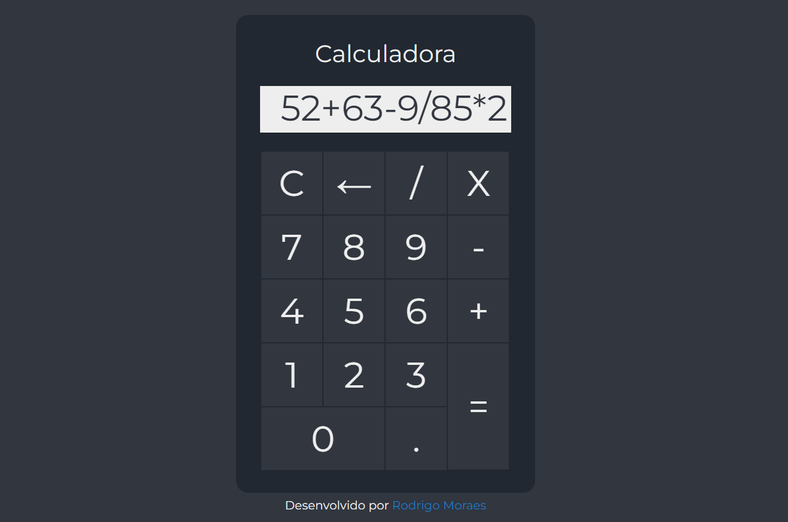

# Ferramenta: Calculadora

## 👨🏻‍💻 [Abrir Projeto](https://tool-calculator.vercel.app/)

## 📝 Introdução

Ferramenta desenvolvida para cálculos matemáticos básicos de forma rápida e precisa.

## 💡 Sobre

Desenvolvi esta ferramenta utilizando HTML e CSS para proporcionar uma experiência agradável e responsiva em diversos dispositivos. Com o uso de JavaScript, defini as regras e funções necessárias para a calculadora realizar cálculos matemáticos do dia a dia.

🔢Valores: 
Insira os valores com seu mouse para calcular instantaneamente. 

🧮Operações 
Escolha entre: Soma, Subtração, Multiplicação e Divisão. 

🟰Display: 
Veja o resultado imediatamente no visor. 
`C`: Limpa o visor | `←`: Remove o último número inserido

## 🤖 Tecnologias

  
  
  
  

---

- `HTML`: Através do HTML realizamos o desenvolvimento da estrutura, assim como definimos e organizamos o conteúdo de forma que seja facilmente interpretado pelos navegadores web.

- `CSS`: O CSS nos permite controlar a aparência e o layout da nossa ferramenta, proporcionando uma experiência visual atraente, responsiva e consistente para quaisquer dispositivos.

- `JavaScript`: O JavaScript é a linguagem de programação utilizada para tornar nossa página interativa, definindo as regras, cálculos e funções necessárias para automatizar a calculadora.

- `DevIcon`: Utilizei a coleção de ícones de alta qualidade do DevIcon, justamente para representar os ícones das tecnologias utilizadas no GitHub, esse ícones são projetados para representar várias tecnologias e ferramentas de desenvolvimento de software.

---

**Desenvolvido por [Rodrigo Moraes](https://github.com/rodrigomoraesdev)**
